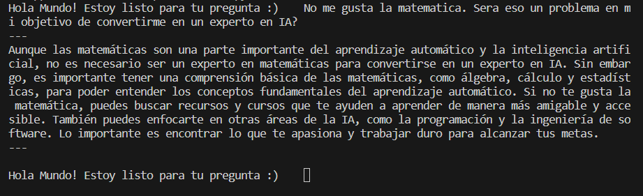
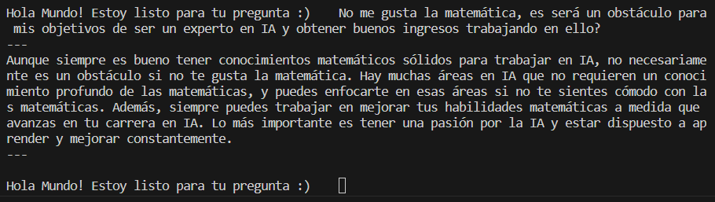
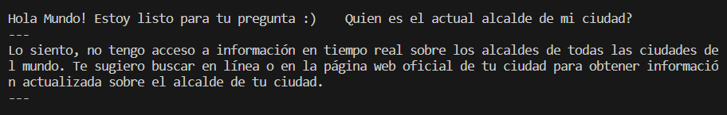
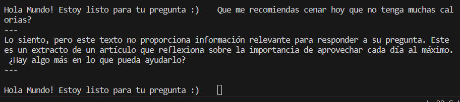

# Version 1.0.0
This CLI app translate a pdf from Andrew Ng about How to build a career in AI, then uses the translation as a knowledge database to anwser questions about this topic using an API KEY from GTP Plus.

## About de source document
You can find the source document used as the knowledge database in this repo

## Same anwsers are

